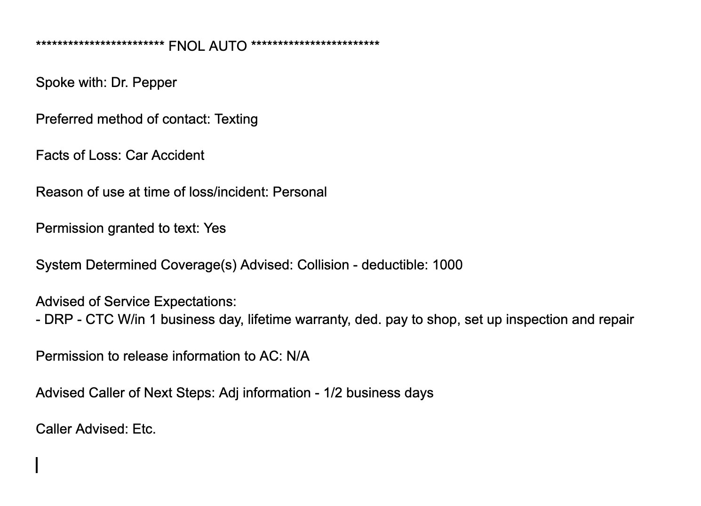

# OnTrack

## Overview
OnTrack is a note-taking application designed for internal use at USAA. It leverages USAA's internal templates to serve as a centralized hub, streamlining documentation processes and enhancing efficiency.

## Features
- Utilizes USAA internal templates for consistent note-taking.
- Acts as a hub to manage and streamline documentation workflows.
- Simplifies the creation and organization of notes for various purposes.

## Usage
1. Access the app via the USAA internal interface.
2. Select the appropriate template from the available options.
3. Input details as needed and save or copy the generated notes.

## Installation
This app is intended for internal USAA use and requires internal installation. Contact the IT department for access.

## Contributing
Contributions are managed internally by the USAA development team. Please follow internal guidelines for submitting changes.

## Support
For support, reach out to the USAA IT helpdesk with any issues or questions regarding OnTrack.

